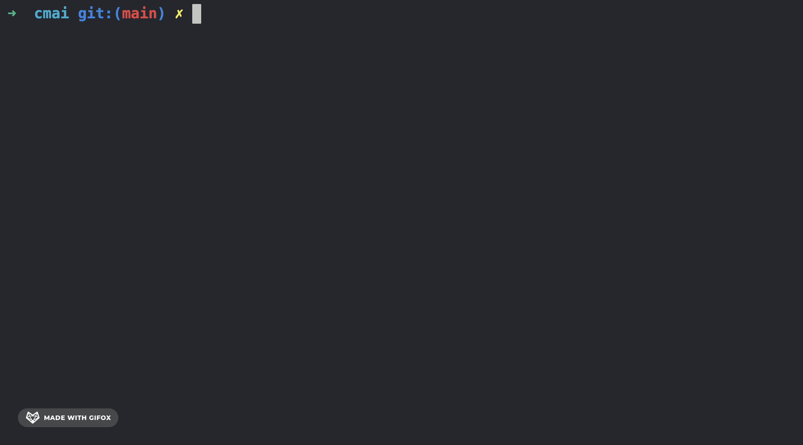
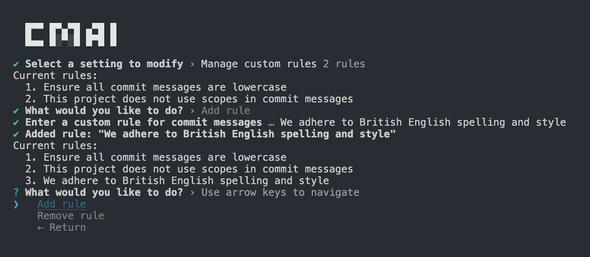

# ⚡️ cmai - commits que se escriben solos


[](https://www.npmjs.com/package/cmai)
[](https://codecov.io/gh/alexwhin/cmai)
[](https://packagephobia.com/result?p=cmai)




## Qué hace

**cmai** analiza tus cambios preparados (staged) de git y genera mensajes de commit siguiendo los estándares de commit existentes de tu proyecto. Crea dinámicamente mensajes contextualmente apropiados en múltiples idiomas.

- ⚡ Flexibilidad de proveedores – admite OpenAI, Anthropic y Llama local (vía Ollama)
- 🧐 Generación inteligente de commits – Mensajes conscientes del contexto a partir de cambios preparados e historial de git
- 🏃 Flujo de trabajo rápido – modos de salida para terminal, interactivos y portapapeles con soporte multipplataforma
- ⚙️ Aplicación de reglas – define reglas por proyecto o globales para mantener los commits consistentes
- 📝 Múltiples sugerencias – genera y regenera opciones de commit hasta encontrar una adecuada
- 🌍 Soporte multilingüe – genera commits en más de 25 idiomas
- 🗜️ Compatibilidad con commitlint – funciona perfectamente con configuraciones existentes de commitlint
- 🔒 Seguridad integrada – redacta automáticamente claves API, tokens y secretos antes de enviarlos a la IA
- 📊 Consciente de git – contexto de rama, análisis de commits recientes y manejo de diffs grandes

## Instalación

```bash
pnpm add -g cmai
npm install -g cmai
yarn global add cmai
```

### Probar sin instalar

También puedes ejecutar cmai sin instalarlo globalmente usando `pnpx` (o `npx`):

```bash
pnpx cmai init
npx cmai init
```

## Guía de inicio rápido

```bash
git add .
cmai
```

### Modos de uso

| Modo      | Descripción                               |
| --------- | ----------------------------------------- |
| clipboard | Copiar al portapapeles (predeterminado)   |
| commit    | Crear un commit de Git directamente       |
| terminal  | Mostrar un comando `git commit` para editar |
| display   | Mostrar solo los mensajes                 |

## Uso general

```bash
cmai init         # Configurar proveedor y clave
cmai settings     # Modificar configuración
cmai              # Generar mensajes de commit
cmai --dryrun     # Previsualizar prompts antes de enviar
```



## Configuración

**⚠️ Advertencia**: La configuración se almacena por proyecto en `.cmai/settings.json`. Dado que este directorio contiene tu clave privada, asegúrate de incluirlo en tu `.gitignore`.

```json
{
  "provider": "OLLAMA",
  "maxCommitLength": 72,
  "commitChoicesCount": 8,
  "usageMode": "TERMINAL",
  "redactSensitiveData": true,
  "customRules": [
    "all commit messages must be lowercase"
  ],
```

### Variables de entorno

Todas las configuraciones pueden anularse mediante variables de entorno:

```bash
CMAI_PROVIDER=ANTHROPIC
CMAI_MODEL=claude-3-haiku-20240307
CMAI_USAGE_MODE=COMMIT
CMAI_COMMIT_LANGUAGE=es
```

## Desarrollo

### Requisitos previos

- `node` >=`18.0.0`
- `pnpm` `10.14.0` (ejecutar `corepack enable` para instalar)
- SonarScanner (opcional): `brew install sonar-scanner`
- Docker/OrbStack (opcional): para probar GitHub Actions localmente

### Configuración

```bash
pnpm install

# Modo desarrollo (reconstrucción automática ante cambios)
pnpm dev
```

### Comandos disponibles

#### Desarrollo principal

```bash
pnpm dev              # Modo observador con compilación y verificación de tipos concurrentes
pnpm build            # Compilación para producción
pnpm test             # Ejecutar pruebas en modo observador
pnpm test:ci          # Ejecutar pruebas una vez (para CI)
pnpm test:coverage    # Generar informe de cobertura (umbral del 80%)
```

#### Calidad del código

```bash
pnpm lint             # Comprobar estilo del código
pnpm lint:fix         # Corregir automáticamente problemas de estilo
pnpm typecheck        # Verificación de tipos de TypeScript
pnpm knip             # Buscar código/dependencias no utilizadas
pnpm knip:fix         # Eliminar dependencias no utilizadas
```

#### Análisis y depuración

```bash
pnpm sonar:local      # SonarCloud (requiere SONAR_TOKEN del proyecto)
pnpm bundle:stats     # Analizar tamaño del bundle
pnpm analyze          # Análisis del contenido del paquete
pnpm act              # Probar GitHub Actions localmente (necesita Docker)
```

#### Proceso de lanzamiento

```bash
pnpm release          # Lanzamiento interactivo con actualización de versión y registro de cambios
pnpm release:dry      # Previsualizar lanzamiento sin publicar
```

## Contribuciones

Se agradecen las contribuciones, informes de problemas y solicitudes de nuevas funcionalidades. Si deseas participar, abre un issue o envía un pull request para ayudar a mejorar el proyecto.

## Licencia

Este proyecto se publica bajo la Licencia MIT.
Creado y mantenido por [Alex Whinfield](https://github.com/alexwhin).
