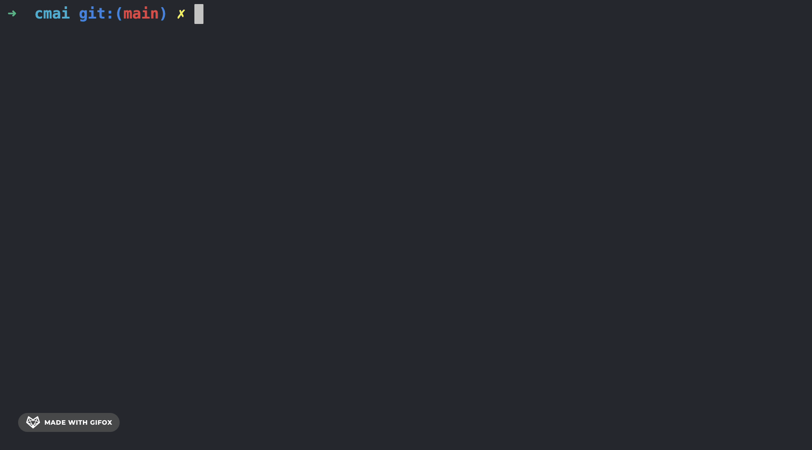

# cmai - commits that write themselves


[](https://www.npmjs.com/package/cmai)
[](https://codecov.io/gh/alexwhin/cmai)
[](https://packagephobia.com/result?p=cmai)

[](https://libraries.io/npm/cmai)



## What It Does

**cmai** analyzes your staged git changes and generates commit messages following your projects existing commit standards. Dynamically creating contextually appropriate messages in multiple languages.

- 🧩 Provider flexibility – supports OpenAI, Anthropic, and local Llama (via Ollama)
- ⚡ Smart commit generation – Context-aware messages from staged changes and git history
- 🏃 Fast workflow – terminal, interactive, clipboard output modes with cross-platform support
- ⚙️ Rule enforcement – define per-project or global rules to keep commits consistent
- 📝 Multiple suggestions – generate and regenerate commit options until one fits
- 🌍 Multi-language support – generate commits in 25+ languages
- 🔒 Built-in safety – auto-redacts API keys, tokens, and secrets before sending to AI
- 📊 Git-aware – branch context, recent commit analysis, and large diff handling

## Installation

```bash
pnpm add -g cmai
npm install -g cmai
yarn global add cmai
```

## Quick Start Guide

```bash
git add .
cmai
```

## General Usage

```bash
cmai init         # Set up provider and key
cmai settings     # Modify configuration
cmai              # Generate commit messages
cmai --dryrun     # Preview prompts before sending
```

### Usage Modes

| Mode      | Description                               |
| --------- | ----------------------------------------- |
| clipboard | Copy to clipboard (default)               |
| commit    | Create a Git commit directly              |
| terminal  | Output a `git commit` command for editing |
| display   | Show the messages only                    |

## Configuration

**⚠️ Warning**: Settings are stored on a per project basis under `.cmai/settings.json`. Since this directory contains your private key, please ensure it’s listed in your `.gitignore`.

```json
{
  "provider": "OLLAMA",
  "maxCommitLength": 72,
  "commitChoicesCount": 8,
  "usageMode": "TERMINAL",
  "redactSensitiveData": true,
  "customRules": [
    "all commit messages must be lowercase"
  ],
```

### Environment Variables

All settings can be overridden with environment variables:

```bash
CMAI_PROVIDER=ANTHROPIC
CMAI_MODEL=claude-3-haiku-20240307
CMAI_USAGE_MODE=COMMIT
CMAI_COMMIT_LANGUAGE=es
```

## Development

```bash
pnpm install
pnpm dev        # Watch mode
pnpm test       # Run tests
pnpm build      # Production build
```

## Contributing

Contributions, issues, and feature requests are welcome.
If you’d like to get involved, please open an issue or submit a pull request to help improve the project.

## License

This project is released under the MIT License.
Created and maintained by [Alex Whinfield](https://github.com/alexwhin).
