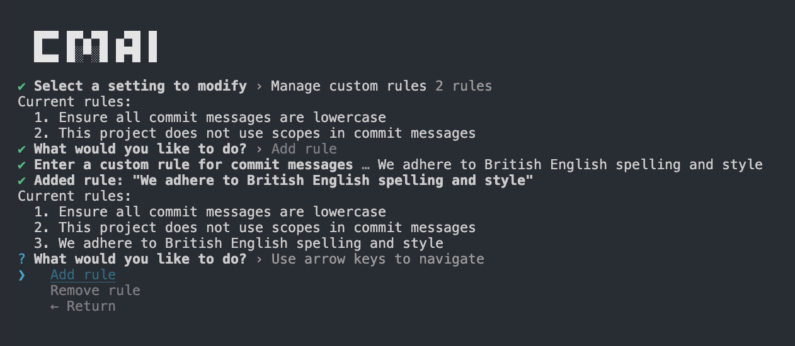

# cmai - commits that write themselves


[](https://www.npmjs.com/package/cmai)
[](https://codecov.io/gh/alexwhin/cmai)
[](https://packagephobia.com/result?p=cmai)


## What It Does

**cmai** analyzes your staged git changes and generates commit messages following your projects existing commit standards. Dynamically creating contextually appropriate messages in multiple languages.

- ⚡ Provider flexibility – supports OpenAI, Anthropic, and local Llama (via Ollama)
- 🧐 Smart commit generation – Context-aware messages from staged changes and git history
- 🏃 Fast workflow – terminal, interactive, clipboard output modes with cross-platform support
- ⚙️ Rule enforcement – define per-project or global rules to keep commits consistent
- 📝 Multiple suggestions – generate and regenerate commit options until one fits
- 🌍 Multi-language support – generate commits in 25+ languages
- 🗜️ Commitlint compatibility – works seamlessly with existing commitlint setups
- 🔒 Built-in safety – auto-redacts API keys, tokens, and secrets before sending to AI
- 📊 Git-aware – branch context, recent commit analysis, and large diff handling

## Installation

```bash
pnpm add -g cmai
npm install -g cmai
yarn global add cmai
```

### Try Without Installing

You can also run cmai without installing it globally using `pnpx` (or `npx`):

```bash
pnpx cmai init
npx cmai init
```

## Quick Start Guide

```bash
git add .
cmai
```

### Usage Modes

| Mode      | Description                               |
| --------- | ----------------------------------------- |
| clipboard | Copy to clipboard (default)               |
| commit    | Create a Git commit directly              |
| terminal  | Output a `git commit` command for editing |
| display   | Show the messages only                    |

## General Usage

```bash
cmai init         # Set up provider and key
cmai settings     # Modify configuration
cmai              # Generate commit messages
cmai --dryrun     # Preview prompts before sending
```



## Configuration

**⚠️ Warning**: Settings are stored on a per project basis under `.cmai/settings.json`. Since this directory contains your private key, please ensure it’s listed in your `.gitignore`.

```json
{
  "provider": "OLLAMA",
  "maxCommitLength": 72,
  "commitChoicesCount": 8,
  "usageMode": "TERMINAL",
  "redactSensitiveData": true,
  "customRules": [
    "all commit messages must be lowercase"
  ],
```

### Environment Variables

All settings can be overridden with environment variables:

```bash
CMAI_PROVIDER=ANTHROPIC
CMAI_MODEL=claude-3-haiku-20240307
CMAI_USAGE_MODE=COMMIT
CMAI_COMMIT_LANGUAGE=es
```

---

If you find this project useful in any way, please consider giving it a `star` on `GitHub` — it helps others discover it and supports continued development.

[](https://www.star-history.com/#alexwhin/cmai&Date)

## Development

### Prerequisites

- `node` >=`18.0.0`
- `pnpm` `10.14.0` (`corepack enable` to install)
- SonarScanner (optional): `brew install sonar-scanner`
- Docker/OrbStack (optional): for testing GitHub Actions locally

### Setup

```bash
pnpm install

# Development mode (auto-rebuild on changes)
pnpm dev
```

### Available Commands

#### Core Development

```bash
pnpm dev              # Watch mode with concurrent build & typecheck
pnpm build            # Production build
pnpm test             # Run tests in watch mode
pnpm test:ci          # Run tests once (for CI)
pnpm test:coverage    # Generate coverage report (80% threshold)
```

#### Code Quality

```bash
pnpm lint             # Check code style
pnpm lint:fix         # Auto-fix style issues
pnpm typecheck        # TypeScript type checking
pnpm knip             # Find unused code/dependencies
pnpm knip:fix         # Remove unused dependencies
```

#### Analysis & Debugging

```bash
pnpm sonar:local      # SonarCloud (requires project SONAR_TOKEN)
pnpm bundle:stats     # Analyze bundle size
pnpm analyze          # Package content analysis
pnpm act              # Test GitHub Actions locally (needs Docker)
```

#### Release Process

```bash
pnpm release          # Interactive release with version bump & changelog
pnpm release:dry      # Preview release without publishing
```

## Contributing

Contributions, issues, and feature requests are welcome. If you would like to get involved, please open an issue or submit a pull request to help improve the project.

## License

This project is released under the MIT License.
Created and maintained by [Alex Whinfield](https://github.com/alexwhin).
